こんにちは、ゆきたです。

前回は新しく使い始めてみたSketchのインストールまでをやりました。今回は早速簡単なデザインを作っていきたいと思います。作るものとしては、一般的な小規模のコーポレートサイトのトップページをイメージして作ってみます。→[前回記事はこちら](https://creatase.info/sketch_trial_1/)

※今回この記事で使用している素材画像は全て写真ACから引用しています。

## ファイルを作る

まず「Sketch.app」を起動します。その後、上のタブから「Flie」→「save」と選びます。

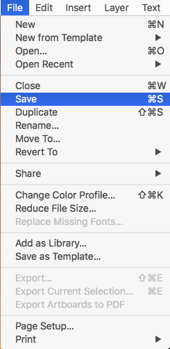

その後出てきたウィンドウでファイル名を入力して「Save」をクリックします。今回は「SampleWebSite」としました。（Javaばっかやってると命名がスネークケースになりがち…。）

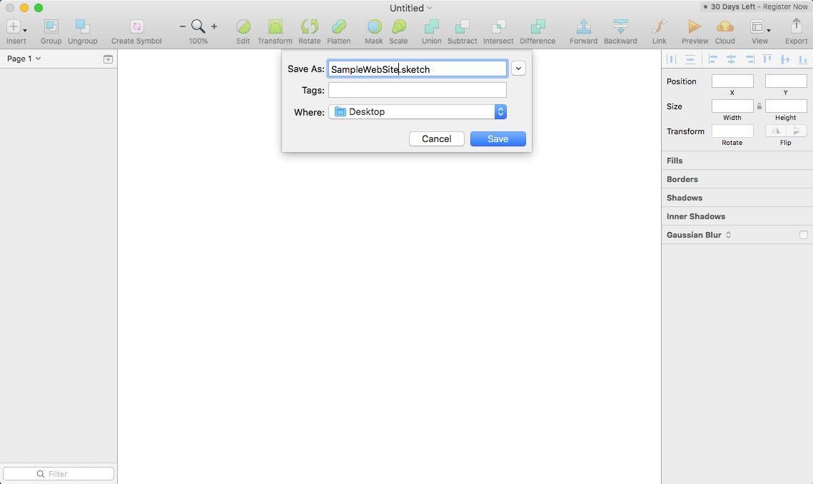

保存が完了すると、下のような「.sketch」ファイルができます。

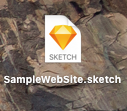

Sketchでは自動的に変更が保存されようになっています。急な停電などがあってもこれで安心。

## アートボードを作成

続いてアートボードを作成します。このアートボード上にテキストや画像などを配置してデザインを作り込んでいきます。画面左上の「＋」ボタンをクリックしてアートボードツールを選びます。（ここ単純に「A」キーを押すだけでもOKです）

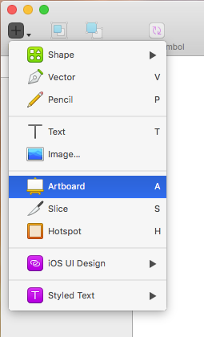

すると画面右側の表示が下のように変わります。このエリアは選んでいるツールなどによって表示内容が変わります。現在はアートボードに切り替わっているので、内容としては作成するアートボードの大きさが選べるようになっています。今回はコーポレートサイトを想定しているので、プルダウンメニューから「Responsive Web」を選択します。

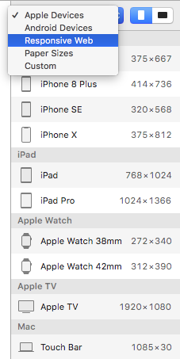

すると選択できるアートボードのサイズが下のように変わります。この状態でひとまず「Desktop 1024×1024」をクリックします。

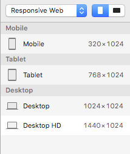

すると画面の表示は特に変わらないのですが、左側のエリアを見ると「Page」の下に「Desktop」という項目が一つ増えているのがわかります。これが今クリックして作成したアートボードです。

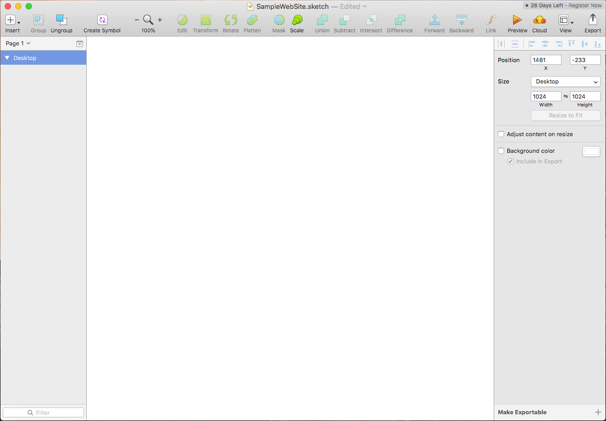

ここで一度「command + 1」キーを押してみましょう。そうすると今選ばれている「Desktop」アートボードが画面サイズにちょうどおさまるように縮小表示されます。このような便利なショートカットキーがたくさんあるのでどんどん使っていきましょう。これでアートボードができました。

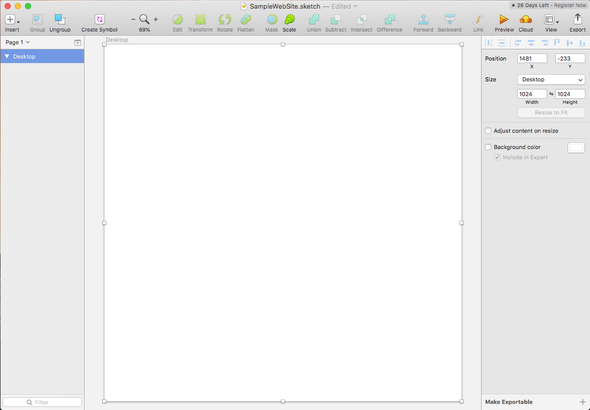

## テキストの配置

続いてWebサイトの各パーツを配置していきます。まずはテキストを配置していきます。左上の「＋」ボタンをクリックして「Text」をクリックします。（ここ単純に「T」キーを押すだけでもOKです）

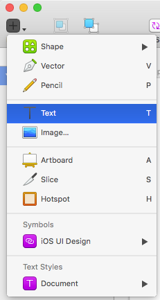

そのあとアートボードの適当な位置をクリックします。すると下のような状態になります。

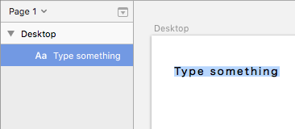

左側を見ると、アートボード「Desktop」にテキスト「Type something」が追加されたのがわかります。この状態で文字を打ち込めばテキストの内容を変えることができます。テキストの編集を終わるには「Command + return」キーを押すか、マウスで他の場所をクリックすると終了できます。

一度編集したテキストを修正する場合は、編集したいテキストをダブルクリックすると編集できる状態になります。

テキストの文字サイズやフォント、色などを変えたい場合は、テキストが選択されている状態で左側のエリアで操作します。（上からフォント、文字の太さ、下線などのオプション、色、文字サイズ、配置、字間、行間、段落間、透明度、ブレンドの処理方法）

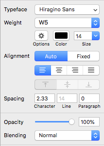

例えばこれでサイトのヘッダーを作るとこんな感じになりました（シンプル…）。

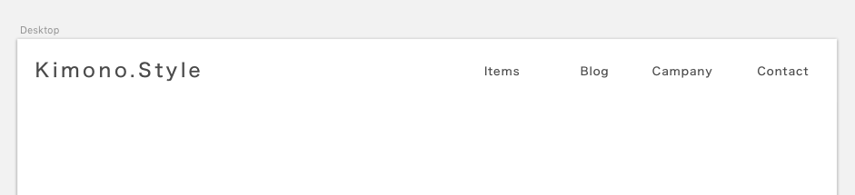

ちなみに複数のテキストをまとめて選択して、並びを揃えることもできます。複数選択するときは「Shift」キーを押しながらクリックするか、マウスでドラッグして範囲を指定します。

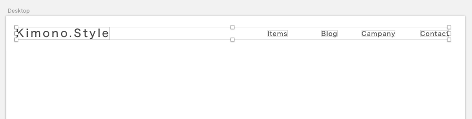

この状態で左側のエリアの一番上の行にあるボタンをクリックすると並びを揃えることができます。この場合は右から２番目をクリックして各テキストの中心を水平方向に揃えました。

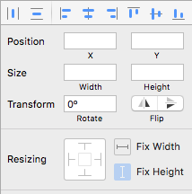

## シェイプの配置

続いて説明の都合上シェイプの配置をしていきます。Webサイトでよくあるボタンや枠などをこれで表現します。左上の「＋」ボタンをクリックして「Shape」→作りたい形を選んでクリックします。今回は四角形「Rectangle」を選んで背景を表現してみます。（ここ四角形の場合は単純に「R」キー押すだけでもOKです）

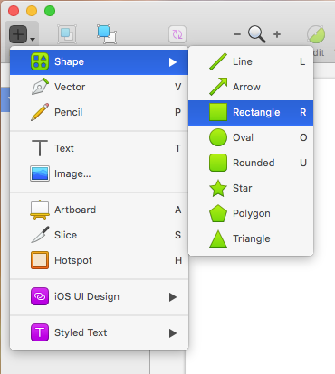

アートボード上の適当な場所にドラッグして四角形を作ります。

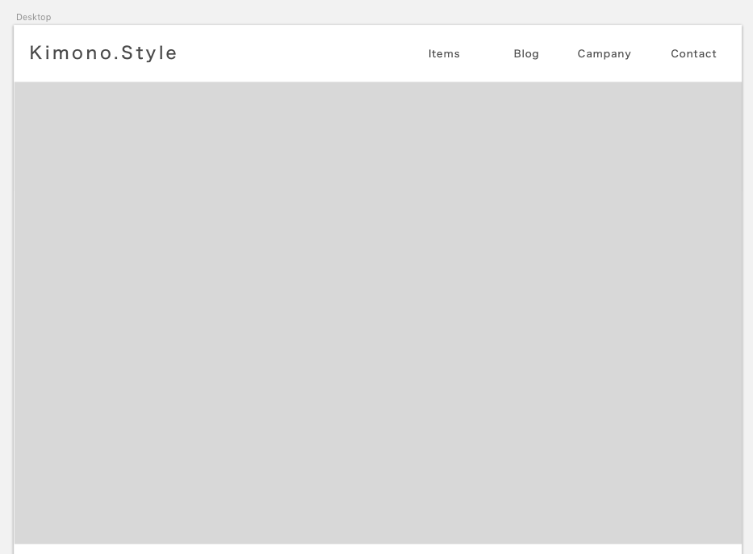

このシェイプを選択すると、左側のエリアで枠線や色などを変えることができます。（上からリサイズ、角丸の大きさ、レイヤースタイル、全体の透明度、背景色、ブレンドの処理方法、背景色の透明度、枠線の色、線の位置、線の太さ、影、内側への影、ぼかし効果）

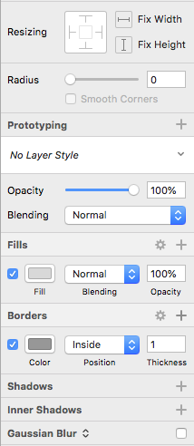

とにかく色々と設定をいじれるので、まずは一つ四角形を作って色々設定を変えて見た方が直感的にわかると思います。テキストと組み合わせるとこんな感じのボタンも簡単に作れます。（これただの画像なのでクリックしないでね） 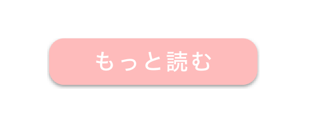

## 写真などの配置

続いて画像を配置していきます。画像の配置方法には２通りあります。一つは画像を先に配置しシェイプでマスクする方法。もう一つはシェイプを先に配置して、画像を設定する方法です。

まず先に画像を配置する方法から。左上の「＋」ボタンから「Image」をクリックします。

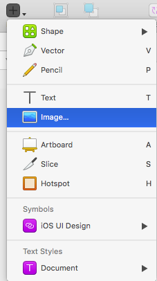

出てきたダイアログボックスで配置したい画像を選んで「Open」をクリックすると、アートボードの適当な場所に画像が貼り付けられます。

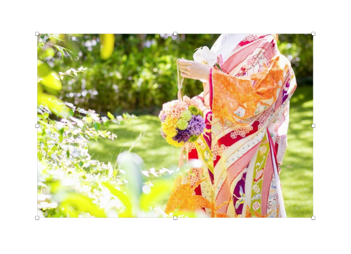

もし画像全体を使いたい場合は、この状態で適当な大きさに変更するだけでOKです。（角の□をドラッグしてサイズを変えることができます。「Shift」を押しながら変更するとタテヨコ比を変えずにサイズ変更できます）この画像の一部分を使いたい場合は、使いたい部分にシェイプを作ります。例えば右側の人物だけ使いたい場合、下のようにシェイプを作ります。

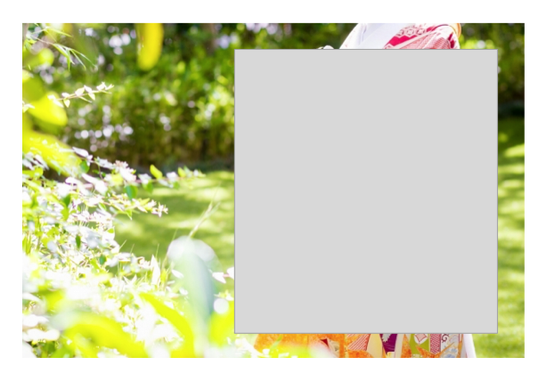

シェイプを作れたら、画像とシェイプ両方を選択して、上側の「Mask」ボタンをクリックします。

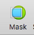

するとシェイプで隠れていた部分だけが表示されます。 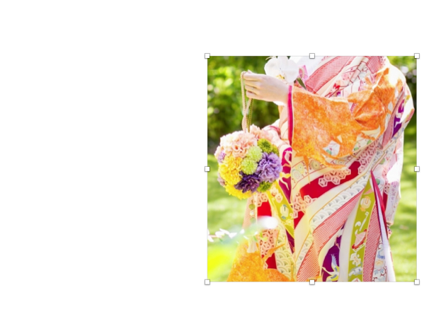

もう一つの方法、先にシェイプを作る方法。まず、画像を表示したい範囲にシェイプを作ります。今回はさっきのヘッダー下のシェイプを利用してみます。

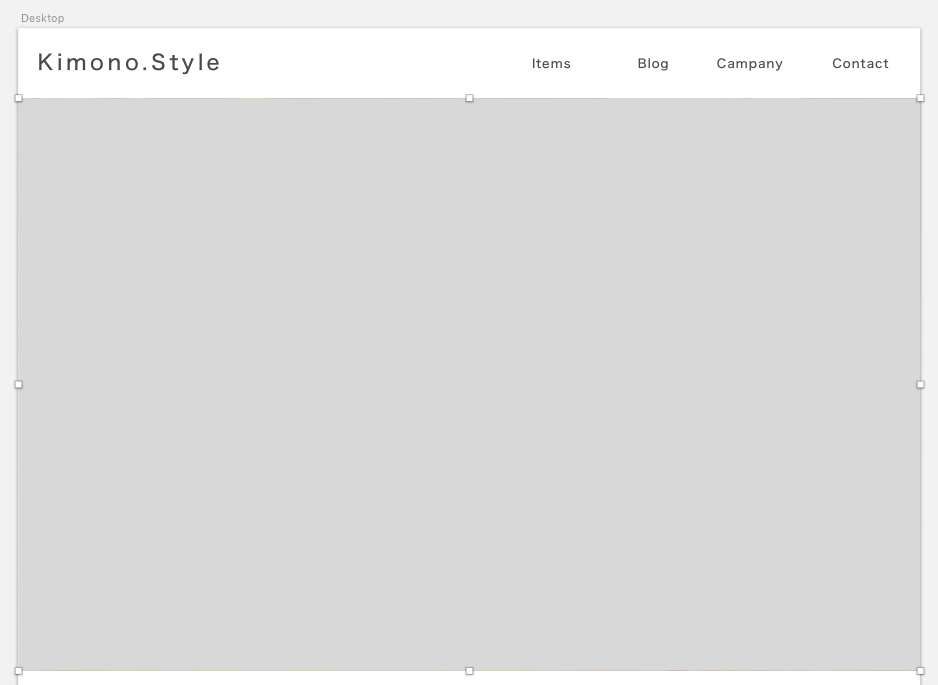

シェイプを選択した状態で、左側のエリアの「Fill」をクリックします。すると下のようなパネルが出てきます。

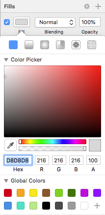

新たに出てきたパネルの一番上の行、左から２番目の写真ボタンをクリックし、そのすぐ下に出てくる「Choose Image」ボタンをクリックすると、ファイルを選択するダイアログボックスが開きます。配置したい画像を選んで「Open」をクリックします。

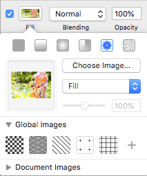

「Choose Image」のすぐ下のプルダウンメニューから写真の配置の仕方が選べます。今回はFillのままにします。

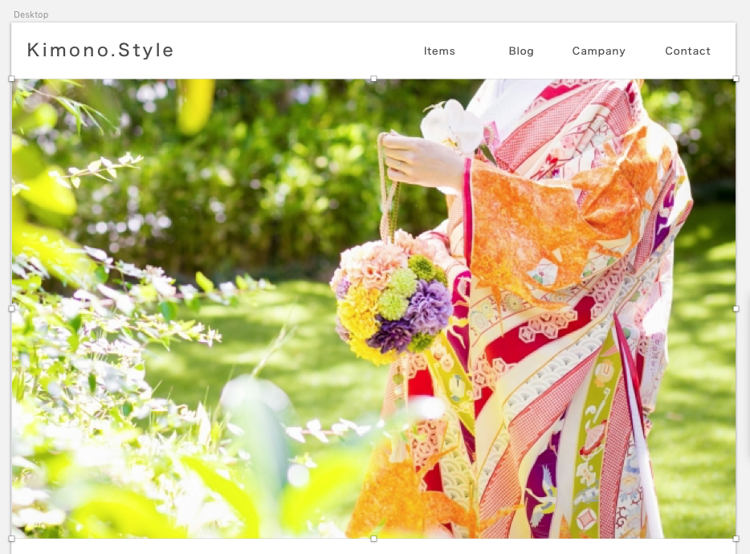

すると先に作成したシェイプに合わせて画像が配置されました。

画像の配置の仕方はどちらも一長一短です。ケースに合わせて使い分けると良さそうです。

## 押さえておきたい便利なテンプレート

Sketchにはスマホの画面やWebサイト上でよく使われる表現がテンプレートとして提供されています。左上の「＋」ボタン→「Symbols」と進んていくとiPhoneのUIデザインなどが簡単に配置できます。

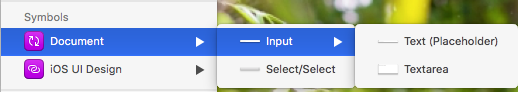

「File」→「New form Template」と選択していくとフォームで使うテキストやテキストエリアなどが簡単にアートボードに配置できます。

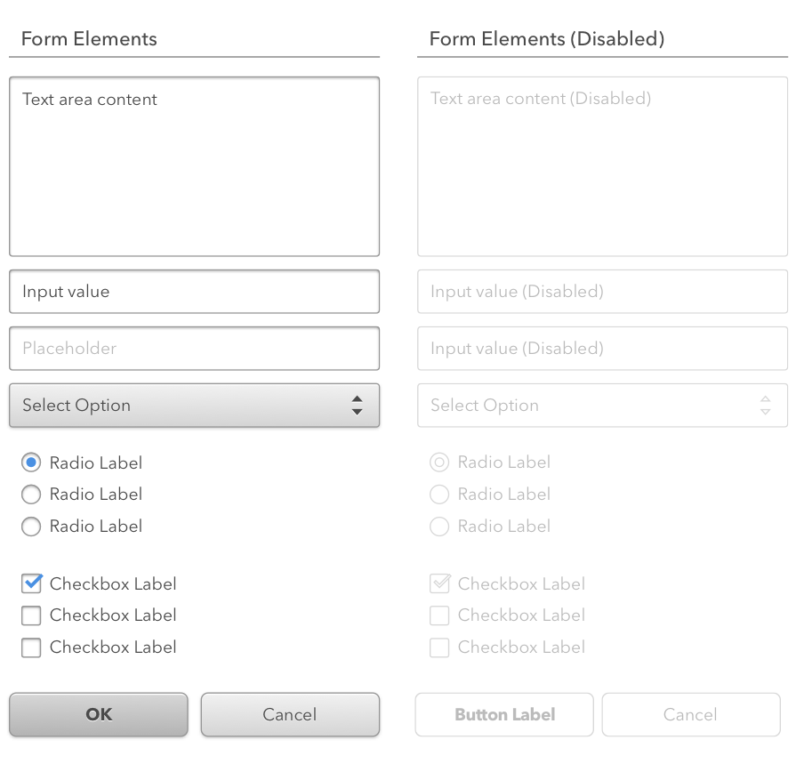

これらをうまく利用してささっとデザインを作れると良いですね。下はコンタクトフォームの一例。

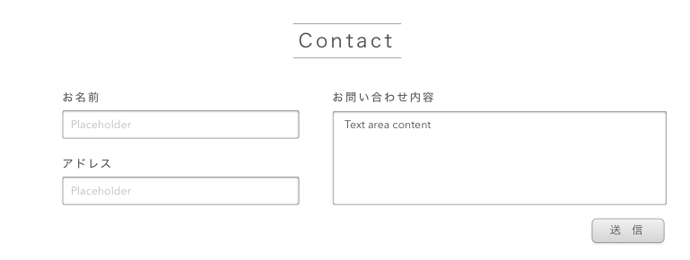

## 完成！！

というわけで、簡単なサイトデザインを作ってみました。上に書いたことを組み合わせたり繰り返したりするとこんな感じになりました。

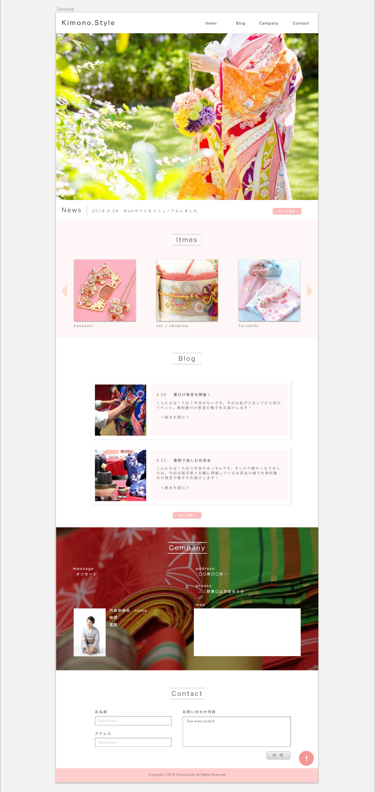

## 感想

まず軽い。そして機能がWebデザインに特化しているのでシンプルで使いやすいという印象でした。SketchにはCSSに書き出す機能も付いているので、これをうまく利用すれば、CSSファイルを書き換えてブラウザで確認して…の繰り返し作業もしなくて済みそうです。この機能はIllustrator CCにもあるのでSketchだからどうということではないですが、DTPをやらないのであればSketchでもいいのかなと思いました。

何かのご参考になれば幸いです。最後まで読んでいただいてありがとうございました。

- [Sketchでデザイン制作｜準備編](https://creatase.info/sketch_trial_1/)
- Sketchでデザイン制作｜デザイン編 ←いまココ

