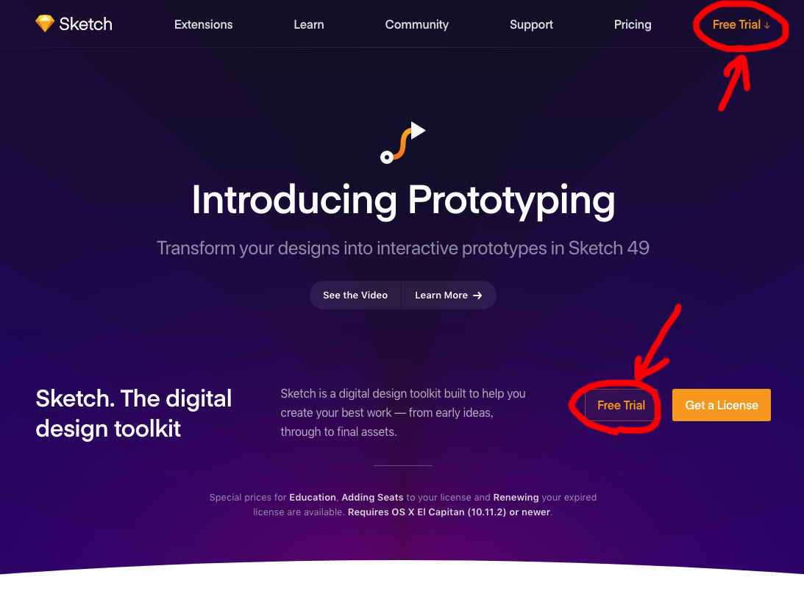
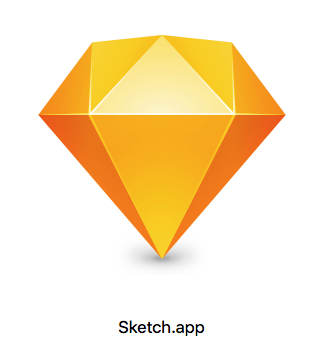
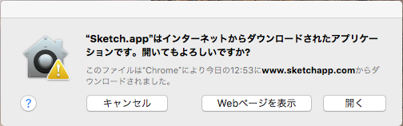
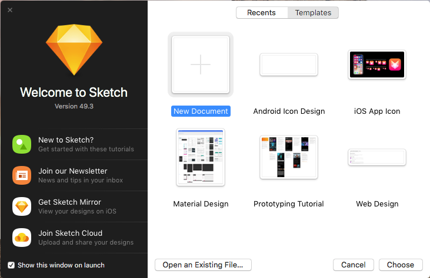
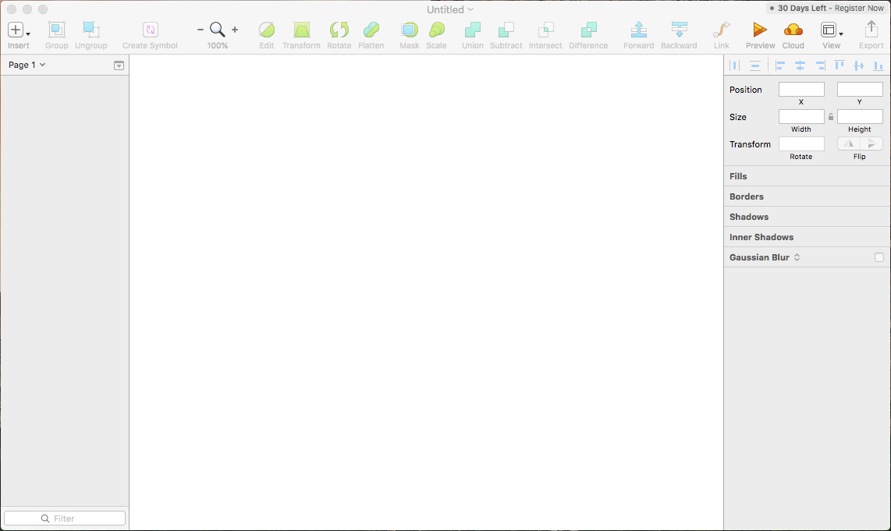

こんにちは、ゆきたです。

資格の勉強もひと段落してきて、そろそろポートフォリオサイトの一つでも作ろうかと思っている今日この頃です。ツイッターをやっていると本当に日々様々な技術や情報が流れてきますね。やってみたいことや試してみたいことがどんどん増えて困ります。で、「せっかくならまとめてやってしまおう」ということで、ポートフォリオサイト制作に合わせて色々試してみようと思います。

今回はその中の一つSketchの使い勝手を試してみたいと思います。ちなみにMac用のツールです。

## Sketchとは

簡単に言ってしまうとUIデザインツールです。つまりWebサイトやアプリの操作画面のデザインをする目的で使われるツールです。私はもともとPhotoshopやIllustratorを使う人間なのですが、それらのバージョンはCS5止まり（…時代が）。。Sketchはそれらと同じような位置づけで利用されているツールになります。ただ、Sketch独自の機能もあり、そのあたりの使い勝手なども今回は試してみたいと思います。

→[公式サイト](https://www.sketchapp.com/)

## 環境など

- mac OS 10.13.4 (Mac mini)
- プロセッサ 2.4 GHz
- メモリ 8GB

…かなり古い型のmacなのでわりと貧弱。

## ダウンロードして起動してみる

Sketchは30日間無料で使用することができます。いわゆるお試し期間ですね。今回はその無料期間を利用して色々やってみたいと思います。まずは[公式サイト](https://www.sketchapp.com/)からダウンロードします。

公式サイトの「Free Trial」をクリックすると自動的にzipファイルのダウンロードがスタートします。ダウンロードが完了したらzipファイルをダブルクリックで展開します。

展開されたらSketch.appをダブルクリックして起動します。

初回のみ、上のような表示が出ます。開くをクリックします。

上のようなウィンドウが開きます。この画面は左下のチェックを外すことで表示しないように設定できます（ただし戻し方は不明…）。右側に各種テンプレートが並んでいます。最初なので「New Document」を選んで右下の「Choose」をクリックします。

するとこのような画面が開きます。この画面で、デザインを作っていきます。…そうです、Sketchのインターフェースは全て英語なのです。英語苦手な人にはちょっとハードルが高いかもしれませんが、機能や使い方を解説している記事もたくさんあるので、使いながら慣れていけば大丈夫だと思います。

ちなみに私のようにPhotoshopやIllustratorの経験があるの場合、この手のツールはなんとなく使い方が分かってしまうと思います。そういった経験がなくても、各ツールが割と直感的に使えるよう配慮されているので、慣れるのにそう時間はかからないのではないでしょうか。

今回はこの辺にして、次回は早速このSketchで簡単なデザインをしてみたいと思います。

- Sketchでデザイン制作｜準備編　←いまココ
- [Sketchでデザイン制作｜デザイン編](https://creatase.info/sketch_trial_2/)
