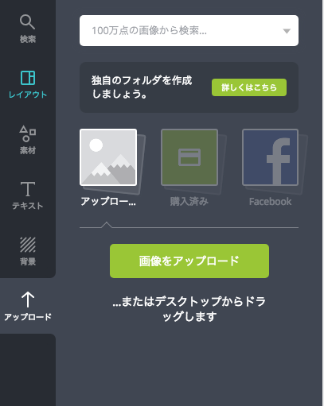

こんにちは、ゆきたです。

久しぶりの投稿です。ずっとアプリやサービスを作りまくっていて、そろそろブログでアウトプットしなきゃなーと思っていたのですが、今日ようやく重い腰をあげました（重すぎる腰…）。

さて、久しぶりにブログを書こうと思ったら、過去記事で思いの外自分が頑張ってアイキャッチ画像を作っていたので「正直記事を書くのに時間かかっちゃうから、自分のブログだし画像の作成もっと楽にできないかなぁ…（←問題発言）」と思い、以前から気になっていた『Canva』を使ってみました。

使ってみた結果、これは使える！！だったのでまず先に、Canvaの使い方と思ったことなどを記事にまとめたいと思います。

## １.アカウントを作る

まず最初にCanvaの[Webサイト](https://www.canva.com/)を開きます。

トップページ左の枠から利用目的を選択します。私は一番下の個人を選択。

続いてアカウント登録方法の選択。現時点ではFacebookやGoogleで登録することも可能なようですね。今回私は一番下のメールアドレスで登録しました。

## ２.デザインタイプを選ぶ

アカウントの登録が完了すると上のような画面に切り替わり、カテゴリーから作るデザインのタイプを絞ることができます。ポイントは自分の職業が何かというよりは、作ろうとしているデザインが何用かと考えた方が良さそうという点です。

例えば私はフリーランスですが、今回作りたいデザインはブログのアイキャッチ画像なので、この中だと「ブロガー」を選んだ方が良さそうだなという感じです。ということでブロガーをクリック。

こんな画面が出てきました。自分以外の誰かとデータを共有してデザインを作ることができるのは便利ですね。一人で作る場合は一番下の「チームメンバーの招待をスキップ」をクリックすればOKです。

するとこんな感じでデザインタイプを提案してくれます。好奇心の強い私はもちろん「デザインタイプをもっと見る」をクリック。

カテゴリーや用途別にデザインタイプがずらずらーっと表示されるので、用途に合わせて選びましょう。マウスオーバーさせると表示されるデザインのサイズを参考にすると良いと思います。

今回は適当にブログと電子書籍カテゴリーの中からBlogバナーを選んでみました。

## ３.テンプレートや素材を選ぶ

デザインタイプを選択し終わるとこのような画面になります。

左側のタブでテンプレートとなるレイアウトや素材、テキストなどを選べるようになっています。

「素材」は写真だけでなく図形やイラストなども非常にたくさん用意されています。試しに写真をクリックして見るとこんな感じ↓で無料で使える写真がズラッと表示されます。

無料で使える画像がほんとにたくさん出てきてびっくりでした。しかも使いやすそうな写真が多かったのも好印象でした。画像のキーワード検索もできるようだったので試しに「本」で検索してみました。

↑ではイラストや写真を切り替えて素材を探すこともできるようですね、便利。

続いて「テキスト」ですが、面白いのがすでにいい感じでレイアウトされているテキストのテンプレートをそのまま使えるというところ。これはレイアウトが苦手な人には嬉しい仕組みですね！！

もちろん一つ一つテキストを配置してフォントやサイズ、カーニングなどを調節することもできるので、こだわりたい方はこだわれるようにできています。

「背景」では単なるベタ塗りだけでなくこちらもそのまますぐに使えそうなパターンがたくさん。。。これは、色々選択肢がありすぎて違う意味で時間かかりそうですね。。。

すでに使いたい画像が決まっている場合などは一番下の「アップロード」から画像をアップロードすることもできます。

最終的に私は「レイアウト」から良さげなデザインを選んでテキスト部分を変更することにしました。

## ４.デザインを作る

レイアウトからお好みのデザインを選んでテキスト部分を修正したものが↑です。作業時間３分ぐらい。。。簡単すぎる。

作成したデザインは右上の「ダウンロード」をクリックすることでダウンロードできます。

「ダウンロード」をクリックすると↑のようにファイルの種類などを選択できるので、希望のファイルの種類を選んで「ダウンロード」をクリックしましょう。

実際にダウンロードしたデザインがこちらです。ん！！？フォントが変わってる！？そしてややフォントが弱く（細く）なっていますね。

原因はデザインの段階で英字フォントが選択されていたためです（元々のレイアウトテンプレートのフォントがそうなっていました）。

なのでフォントを日本語のものに変えます。

結構個性的なフォントもあるので個人で使う分には事足りそうな印象でした。ちなみに独自のフォントのデータをアップロードして使用することもできるようになっています。

改めてデザインをダウンロードします。

はい、想定通りのデザインが…と言いたいところですがやはり少し弱く（細く）出力されるようです。ダウンロードしたデータで確認することをお勧めします。

## ５.感想など

今回Canvaを使ってみた感想は、ほんとに無料で簡単にそれっぽいデザインができてしまって「すごい！！」の一言でした。素材の数やテンプレートも豊富でどれもオシャレだったので、単に眺めるだけでも面白そうですね。

いやーデザイン面白い！！ブロガーの方でアイキャッチ画像やトップページバナーなど作るのが億劫だってかたはぜひ一度試してみられてはいかがでしょう。いいデザインが作れると記事書くのも楽しくなる気がします。

というわけで、最後まで読んでいただきありがとうございました。少しでもお役に立てば幸いです！

