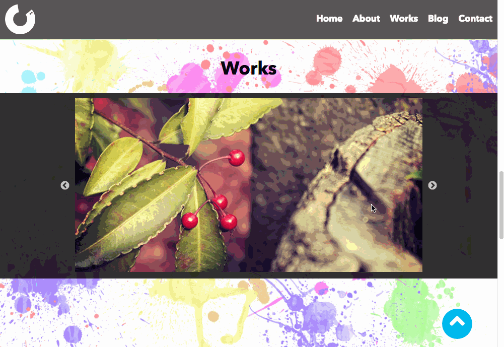
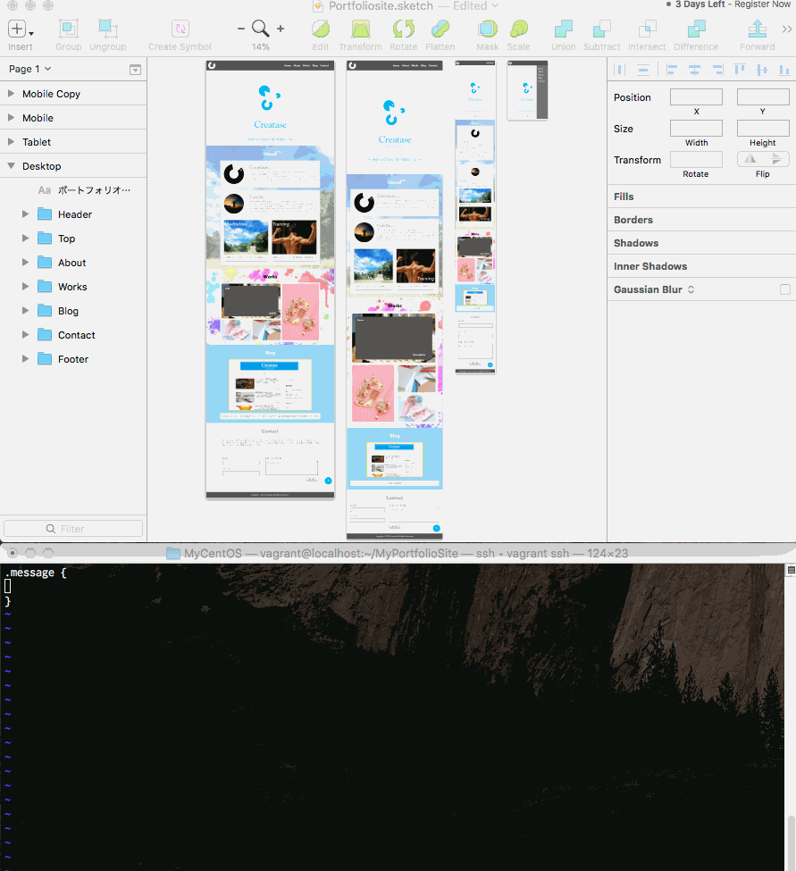
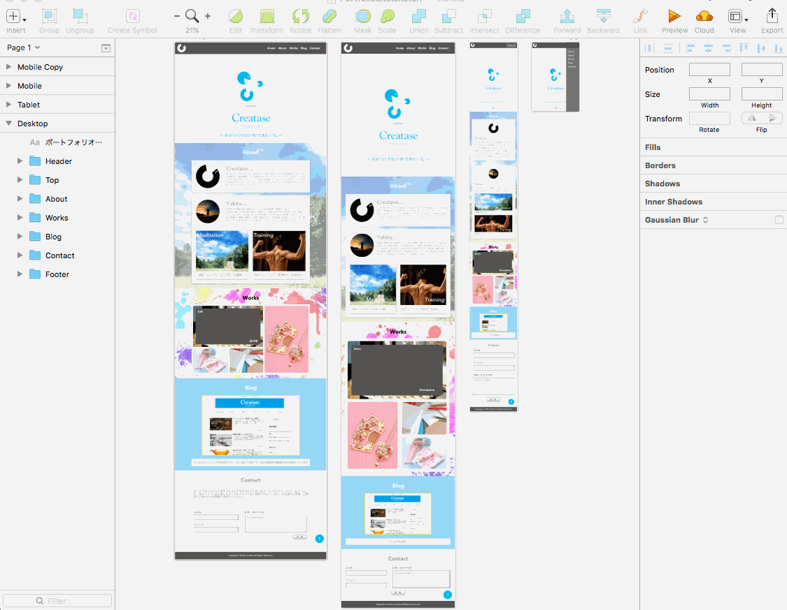

こんにちは、ゆきたです。

前回からだいぶ時間が空いてしまいましたが、制作日記の続きをお届けしたいと思います。前回はこれから作るサイトのデザインをIllustratorとSketchを使ってデザインしてみました。

→前回記事 [ポートフォリオサイト制作日記 Vol.2 デザイン編](https://creatase.info/portfolio_site_creation_2/)

３回目となる今回は、前回作ったデザインを元にHTMLとCSSを書いていきます。

## 環境など

今回はブラウザはとりあえずChromeを使っています。エディタはいつもはAtomを使っているのですが、今回は何を血迷ったかvimを使っています（これ覚えるのでだいぶ時間を使った）。環境はmacOSのなかにVirtualBox&VagrantでCentOSを入れてその中でphp付属のサーバー立ち上げてやりました（ええ、お気付きの通り、まんまドットインストールの開発環境構築です）。それ以外では、Sketchのコピー→CSSという機能を使ってみました。それからちなみに公開する環境はさくらのレンタルサーバーの予定です。


## 課題

今回はポートフォリオサイトを作るにあたって、やってみようと思っていたことがいくつかありました。

- アニメーション（サイトに動きをつける）
- レスポンシブ対応（PCでもスマホでも見られる）
- カルーセル（実績の表示に使ってみたかった）
- Sketchの使い勝手検証

上から順番に説明していきたいと思います。

## CSSアニメーション

これはサイトtopの部分中央に据えたロゴマークをゆっくりくるくる回してみたかったんですね。

できた時には感動のあまり叫びました。（↓最初ちょっと間があります）

<blockquote class="twitter-tweet"><p lang="ja" dir="ltr">CSSアニメーションお試し中…<br>お腹さすりながら操作してて「動いた！」って歓喜した後に<br>手がお腹にあって『そっちじゃない』ってツッコミ入れてる自分に悲しくなった(-᷅_-᷄๑)<br>でもアニメーションおもしろい♪ <a href="https://t.co/PUw1yUUHfF">pic.twitter.com/PUw1yUUHfF</a></p>&mdash; ゆきた＠スリープ中 (@yukita_jp) <a href="https://twitter.com/yukita_jp/status/998380758170402817?ref_src=twsrc%5Etfw">May 21, 2018</a></blockquote>

これは単純にCSSだけで実現できました。具体的には@keyframeでアニメーションの動きの部分を先に定義しておいて、後からそれをセレクタにあてるという手順です。

```
@keyframes rotation {
  0% {
    transform: rotate(0deg);
  }
  100% {
    transform: rotate(360deg);
  }
}
```

rotationはこのアニメーションの名前で任意につけます（animation-name）。つけた名前をあとでセレクタにあてる時に使うのでわかりやすい名前をつけると良いと思います（今回は回転なのでrotation）。0%はfrom、100%はtoと書いてもOKです。また途中の状態を５０％などとして書き足すことも可能です。今回のアニメーションでは０％（最初の状態）、１００％（最後の状態）の二つでできました。で、これをその他諸々の条件とともに適用したいセレクタにあてます。

```
セレクタ {
  animation: rotation 10s liner infinite;
}
```

rotationはアニメーションの名前、10sは１回のアニメーションが終わるまでの時間（msでも指定可能、１０ms＝０．０１sとかにすると超高速回転になる 笑）、linerはアニメーション再生速度の変化を常に一定に指定（ease-in-outとかするとゆっくり始まりゆっくり終わるなどに変えられる）、infiniteはアニメーションを繰り返す回数をずっと繰り返すに指定。他にも色々と指定できる条件がありますが今回はこれで十分と判断しました。

ちなみに地味にシンボルマークの影の部分も動いているんですよ。気づきました？実はこっちの方が設定が細かくてちょっと大変でした。

興味のある方は「CSSアニメーション」で調べてみてくださいね。

## レスポンシブ

実はここ今回で一番やらかしてます。レスポンシブデザインにする方法はとてもたくさんあると思います。CSS3で使えるようになったFlexboxを利用するとか、おなじみのbootstrapを利用するとかとか。…なのですが、今回綺麗さっぱりそのことを忘れていて、結局一つ一つ設定していきました。真似しないでくださいね。フレームワーク使ったほうが簡単ですし早いです。無理に苦行する必要はありません。

→参考記事 [日本語対応！CSS Flexboxのチートシートを作ったので配布します](https://www.webcreatorbox.com/tech/css-flexbox-cheat-sheet)

→参考記事 [Webデザインの知識がなくてもOK！Bootstrapの使い方【入門者向け】](https://techacademy.jp/magazine/6270 "Permanent Link to Webデザインの知識がなくてもOK！Bootstrapの使い方【入門者向け】")

ちなみにレスポンシブデザインの一番基本的なやり方は一つのHTMLに対して画面横幅に応じてCSS Media QueriesでCSSを切り替えます。そしてそれぞれのコンテンツや画像の幅の指定をpxでなく％で指定することで実現します。これはProgateやドットインストールで習得できます。

## カルーセル

ポートフォリオサイトのメインとも言える実績を表示するのに何か仕掛けを使いたいと思っていたのですが、前から気になっていたカルーセル機能（スライダー表示）を使うことにしました。カルーセル機能を実現するプラグインはいくつかあるのですが、今回私はslickを使ってみました。

こちらの記事（→[【jQuery】スライダー系プラグイン slickの使用方法](https://qiita.com/katsunory/items/25b385aae0f07b41e611)）をそのままやるだけで実装できるのですが、、そもそもJavaScript、jQuery、slickの順番で知識が必要で、私はその辺の知識をかなり綺麗に忘れていたので、ドットインストールを見て思い出すところからはじめました。

で、何とか実装できました↓。



実績が溜まってきたら、カルーセルを２段にするとか機能を拡張してみたいと思いつつ、今はとりあえずこれでよしとしておきます。

それより早く中に突っ込む実績を作らなければ…。

## Sketchの使い勝手検証

今回私はサイトのデザインをSketchでやってみたわけですが、それによってコーディングがどれくらい楽になるかを試してみました。

結論としては、「これは使える！！」でした。正直私はまだまだ全然使いこなせてないと思うのですが、Sketchから色々と情報を取り出せるので、一度デザインした通りに作りやすいのです。２つほど紹介します。

まず一つ目はCSSへのコピー。（実際にやってみた↓）



見たまんまですが、Sketchで作ったデザインを右クリックして「Copy CSS Attributes」でコピー → エディタに切り替えてペーストでポン！と諸々の設定がペーストできます。おぉ…便利。

もう一つはpaddingやmarginを設定するときに、どれくらい空けたっけな？となったときにすぐに確認できる機能です。（これも実際にやってみた↓）



これまた見たまんまですが、Sketch上で調べたいテキストなどのコンテンツを選んでoption（alt）キーを押下しながらカーソルを動かすと、選択したコンテンツとカーソル下のコンテンツの距離を表示してくれます。おぉ…便利。

今回は無料お試し期間が迫っている中で、これくらいしか使いこなせませんでしたが、もっと便利な機能や使い方があるはずなので、暇を見つけて調べてみたいなーと思います。

とりあえずこれで見た目は完成したので、あとはフォーム設置とか諸々確認とかサーバにアップロードとかをやっていきます。では！！

