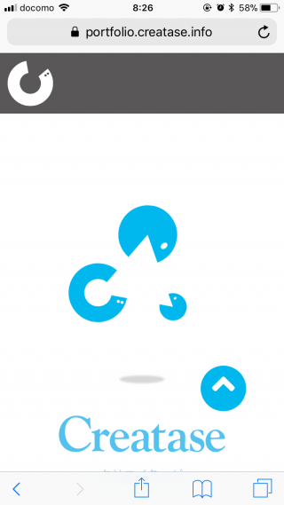
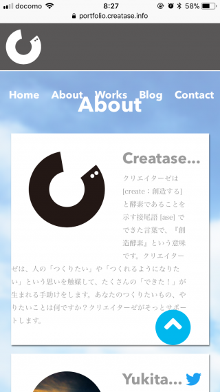
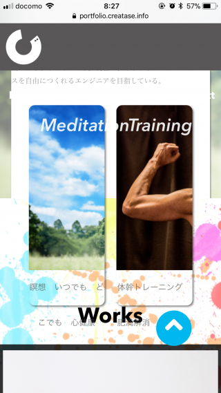
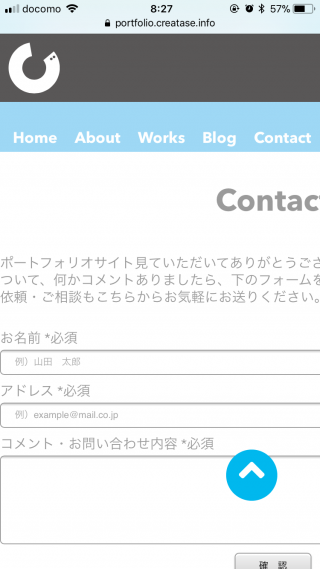

こんにちは、ゆきたです。

ようやくポートフォリオサイトを公開できました。楽しみ楽しみと言って励ましていただいた皆さんのおかげです。この場を借りて深く深ぁ〜く感謝いたします。ありがとうございました。さて、当初計画していた一週間はあっという間に過ぎ、スタートしてから８日目に公開となりました。ま、、不具合など色々残っていると思いますが、もしお気付きの方がいらっしゃったらこっそり優しく教えていただけると頬を緩めて喜びます。

で、今回は完成までにやったフォームの設置とスマホ画面のレイアウト調整のお話しをします。

## フォーム設置

今回お問い合わせフォームは簡易的なものにしました。phpで書いているのですが、実は以前に一回作ってみたことがありました。その時は本を見ながらそのまま書き写して…「で、なんなのこの呪文は？」という状態だったのです。が、今回は散々Javaをやった（資格までとった）あとだったので、全く抵抗なく書けました。しかも前回よりちょっぴり機能を拡張できました。

ちなみに参考にした記事はこの辺りです↓

- [【初心者向け】PHPでメールフォームを作る方法を解説！](https://web-camp.io/magazine/archives/5181)
- [【PHP】PHPでシンプルなメールフォーム](https://www.webdlab.com/labs/form-mail/)
- [PHP開発エンジニア必読！最低限必要なセキュリティ対策](http://www.hp-stylelink.com/news/2013/09/20130913.php)
- [誰でも実装できる！PHPでメール送信を行う方法【初心者向け】](https://techacademy.jp/magazine/11629 "Permanent Link to 誰でも実装できる！PHPでメール送信を行う方法【初心者向け】")

とはいえ半日ほどハマった原因が.（ピリオド）一個だったりとなかなか苦労はしました。

## レイアウト調整／レスポンシブ

続いてレイアウト編、こっちもこっちで大変でした。とりあえず本番環境にあげてみよーっと思ってあげてスマホで確認してみたら…

<blockquote class="twitter-tweet">
あかーん 笑 本番にあげてみたけど予想以上の崩れっぷり 爆笑 やはり一週間では無理だったか…orz 作業明日に持ち越しだ٩( &#39;ω&#39; )و 今日はこのまま寝る（え
&mdash; ゆきた＠スリープ中 (@yukita_jp) <a href="https://twitter.com/yukita_jp/status/999283401772318721?ref_src=twsrc%5Etfw">May 23, 2018</a></blockquote>

そしてこの日（昨日）はさっさと寝ました。

ちなみにどれくらい崩れていたかという恥を晒すと、、

メニューがどっか行った！！どこ行った！？しかも下の文字見切れてるし。。。

あ！メニューおったー！！そこにいたのか。ぬおーぅ、ここは文字回り込んでるし（汗

腕のみ！！う〜んっとこれは…笑笑笑（もうこの辺から笑いが止まらなくなりました）

あぁ…お問い合わせフォームもボロボロ （疲労

という状態だったわけです。

そして今日は気を取り直してこれらを朝からせっせと直していました。くれぐれも皆さんはフレームワークとか使ってくださいね！こうなりますからね！！いや〜でもほんといい勉強になりました。

上のような状態から実際にはどうなったのかはぜひサイトを見て確かめてみてください。

→ポートフォリオサイト(現在はコンテンツをこのブログに移植中です)
→[About](#)

とりあえず普通にはなったんじゃないかな？今の私の全力はこんなもんですが、次は必ずこれを超えるものを作ろうと思います。

というわけでポートフォリオサイトの制作日記は今回で終了となります。今回は全然技術っぽいこと書いてません。すいません。それでも最後まで読んでいただいたみなさまありがとうございました。いろんなコメントいただいたりしてとても楽しかったです。

ではでは〜

