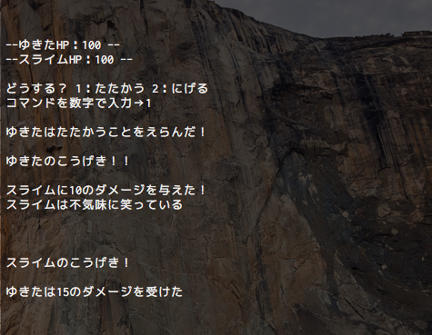
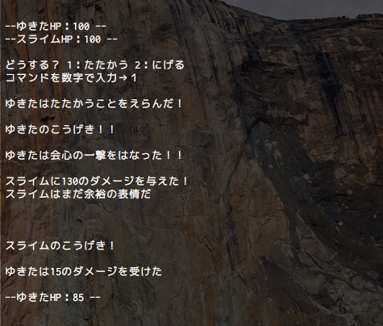
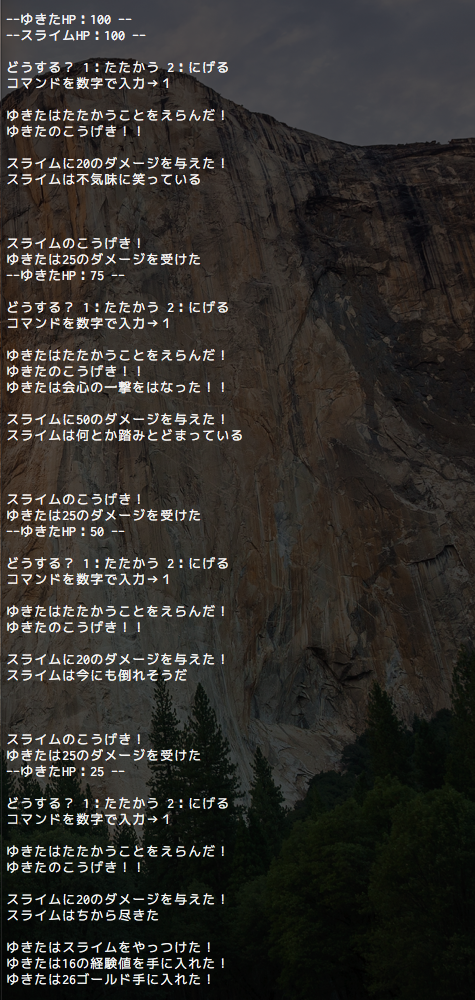

こんにちは、ゆきたです。

Javaでドラクエっぽい対戦ゲームを作ってみています。すでに５回目。こんなに内容が伸びると思わなかったですが、引き続きやっていきたいと思います。前回ようやくお題の半分をクリアしました。今回はお題５以降をコードにしてみたいと思います。

参考：まゆさんの記事はコチラ→[【体験談】神里よしとさんのレッスンで、 Ruby完全初心者が対戦ゲームを作ってみた](https://www.mayuowl.com/ruby-first/)

## お題５ ゆきたの攻撃後、スライムが攻撃してくる

プレイヤーの攻撃処理のコードの下にスライムの攻撃を書いていきます。スライムが攻撃したことを表示 ＋ プレイヤーのHPを減算処理 ＋ プレーヤーがダメージを受けたことを表示の順で書きます。
```Java
System.out.println("\n\n\nスライムのこうげき！");
yukitaHp -= 15;
System.out.println("\nゆきたは15のダメージを受けた");
```


あぁ…。とうとうダメージを…。

さてこれでお題５はクリアしました。次のお題に行きます。

## お題６ ゆきたが受けたダメージ数と、残りのHPを出力する

おっと。先走って前のお題で受けたダメージ数を表示する部分は書いてしまいましたね。それでは残りのHPの出力の部分を足します。初っ端に書いた以下のコードをそのまま流用します。
```Java
System.out.println("\n--ゆきたHP：" + yukitaHp + " --");
```


これでお題６もクリアです。いよいよ次で最後のお題ですね。

## お題７ どちらかが死ぬまで攻撃をループさせる

まずプレーヤーが死んだ場合の表示をスライムの攻撃処理のあとに書き足します。
```Java
if (yukitaHp <= 0) {
  System.out.println("ゆきたはちから尽きた…。");
}
```
次はループさせるところを書いていきます。Javaでは処理をループさせる場合、for文、while文が使えます。今回はwhile文で書いてみます。どちらかが死ぬまで、つまりyukitaHpかslimeHpのどちらかが0以下になった時にループを抜けるように設定します。

色々書き方があると思いますが今回はフラグを使って書きます。
```Java
boolean flag = true;
while (flag) {
 //ループさせたい処理
}
```
boolean型の変数flagを宣言してtrueで初期化します。変数flagをwhile文の条件式に入れて、以降のブロック内にループさせたい処理を入れます。今回は、コマンド選択から以降の全てをループさせます。while文は条件式の評価がtrueの間ループし続けるので、このままだと無限ループになります。ループを抜けたいタイミング＝yukitaHpかslimeHpのどちらかが0以下になった時に
```Java
flag = false;
```
としてflagにfalseを代入し、while文を抜けるようにします。上の文を書き足す箇所は、

- スライムのHPが０以下になった時
- プレーヤーのHPが０以下になった時
- コマンド選択で逃げるを選択した時

とします。

また、プレーヤーの攻撃でスライムが死んだあとにスライムが攻撃しないようにbreak;でswich文を終了するようにします。以下に全文を載せておきます。
```Java
import java.io.*;
import java.util.Random;

public class MiniGame {
  static int yukitaHp = 100;
  static int slimeHp = 100;
  public static void main(String[] args) {
    try {
      System.out.println("--ゆきたHP：" + yukitaHp + " --");
      System.out.println("--スライムHP：" + slimeHp + " --");
      boolean flag = true;
      while (flag) {
        System.out.println("\nどうする？ 1：たたかう 2：にげる");
        System.out.print("コマンドを数字で入力→ ");
        InputStreamReader isr = new InputStreamReader(System.in);
        BufferedReader br = new BufferedReader(isr);
        String str = br.readLine();
        int choice = Integer.parseInt(str);
        switch (choice) {
          case 1:
            System.out.println("\nゆきたはたたかうことをえらんだ！");
            Random random = new Random();
            int critical = random.nextInt(4);
            System.out.println("\nゆきたのこうげき！！");
            if (critical == 1) {
              System.out.println("\nゆきたは会心の一撃をはなった！！");
              slimeHp -= 30;
              System.out.println("\nスライムに30のダメージを与えた！");
            } else {
              slimeHp -= 10;
              System.out.println("\nスライムに10のダメージを与えた！");
            }
            String status = "スライムは";
            status += slimeHp >= 80 ? "不気味に笑っている"
                    : slimeHp >= 60 ? "まだ余裕の表情だ"
                    : slimeHp >= 40 ? "動きが鈍くなってきた"
                    : slimeHp >= 20 ? "何とか踏みとどまっている"
                    : slimeHp > 0 ? "今にも倒れそうだ"
                    : "ちから尽きた";
            System.out.println(status);
            if (slimeHp <= 0) {
              System.out.println("\nゆきたはスライムをやっつけた！");
              System.out.println("ゆきたは16の経験値を手に入れた！");
              System.out.println("ゆきたは26ゴールド手に入れた！");
              flag = false;
              break;
            }
            System.out.println("\n\n\nスライムのこうげき！");
            yukitaHp -= 15;
            System.out.println("\nゆきたは15のダメージを受けた");
            System.out.println("\n--ゆきたHP：" + yukitaHp + " --");
            if (yukitaHp <= 0) {
              System.out.println("\nゆきたはちから尽きた…。");
              flag = false;
            }
            break;
          case 2:
            System.out.println("\nゆきたはにげだした");
            flag = false;
            break;
          default:
            System.out.println("\n1か2を入力してください");
        }
      }
    } catch(IOException e) {
      e.printStackTrace();
    }
  }
}
```
さて、これでうまくいけばお題を全てクリアしたことになります。実行してみます。



※画面サイズの都合で一部の改行を削除しています

無事にスライムをやっつけることができました！これで全てのお題をクリアできましたー！やった。

このプログラミングには割といろんな要素が詰まっているので、Javaを一通り覚えたぐらいの人にはちょうど良い内容だと感じました。何か作ってみたいなと感じている人は小手調べに作ってみてはいかがでしょうか？

- [Javaでドラクエっぽい対戦ゲームを作ってみる【準備編】](https://creatase.info/java_minigame_1/)
- [Javaでドラクエっぽい対戦ゲームを作ってみる【お題１+寄り道編】](https://creatase.info/java_nimigame_2/)
- [Javaでドラクエっぽい対戦ゲームを作ってみる【お題２編】](https://creatase.info/java_nimigame_3/)
- [Javaでドラクエっぽい対戦ゲームを作ってみる【お題３-４編】](https://creatase.info/java_minigame_4/)
- Javaでドラクエっぽい対戦ゲームを作ってみる【お題５-7編】←いまココ
- [Javaでドラクエっぽい対戦ゲームを作ってみる【おまけ】](https://creatase.info/java_minigame_6/)
